# Market-Maker Ladder Analysis (ZSE)

Reverse-engineering the built-in Market Maker from `market_data/ZSE_*.csv`
to see how much of the MM's quote ladder we can recover and how the
recovered structure can be turned into trading signals.

Scripts:
- `analysis/zse_mm_extract.py` — basic signature features + summary CSVs
- `analysis/zse_mm_deep.py` — stacked/flat test, depth-imbalance
  predictivity, ETF-arb cross-check
- `analysis/zse_mm_plots.py` — figures 1–5
- `analysis/all_exchanges_mm.py` — full pipeline across all 10 venues +
  cross-venue divergence (figures 9–12, §10–§12 below)

Outputs are written to `analysis/out/` (CSVs) and `analysis/out/plots/`
(PNGs).


## TL;DR

1. The MM **stacks** 1, 2, 3, 4, 5 lots of 50 shares at the inner five
   price levels per side. The visible top-3 cumulative quantities of
   **50 / 100 / 150** are its fingerprint; total per-side liquidity ≈ 750 sh.
2. We can see the inner three levels directly (when the snapshot is
   "MM-clean"), and infer L4 / L5 by extrapolating the tick step — which
   is **1¢** for tight names (CARD, DDJH, ZABA, ZITO, …) and **2¢** for
   wide names (ETFA, FSR, KRAS, …).
3. Top-3 **depth imbalance predicts the next mid move** (500 ms horizon)
   with correlations up to ±0.49. Importantly, the sign **flips per
   instrument**: stocks like INA, GOLD, KTST are momentum (positive
   correlation), ETFs and a handful of stocks are mean-reverting
   (negative correlation).
4. **ETF mid persistently drifts vs the simple-mean of constituent ZSE
   mids** — gaps of 100–300¢ are common against an MM spread of 2–4¢.
   This is the largest and most actionable edge in the dataset.


## 1. What the recorded data contains

| File | Cols | Notes |
|---|---|---|
| `ZSE_orderbooks.csv` | `time, instrument, bid1..3 px+qty, ask1..3 px+qty` | Top-3 only. Aggregated, anonymous. ~100 ms snapshots. 1 175 rows. |
| `ZSE_trades.csv` | `time, instrument, price, quantity, passive_order_id, active_order_id` | Executed prints. 3 115 rows. |
| `ZSE_events.csv` | `time, instrument, order_id, expired` | Only `expired=False` values present → cancel/expire stream. **No order-add stream → cannot replay an L3 book from this alone.** |
| `ZSE_candles.csv` | OHLCV per second per instrument | Useful for cross-checking out-of-band trade prints. |

**Key limitations of the recording:**
- The book is captured at top-3, so MM levels 4 and 5 are not directly
  visible; they have to be inferred.
- The book is aggregated across all participants, so the visible top-3
  is `MM + team residuals + (any) noise resting orders`.

The captured top-3 is sufficient to recover the MM ladder almost
entirely on the cleaner instruments (see §2), and via reconstruction +
trade-print evidence on the rest.


## 2. MM ladder shape — "stacked" with 50 shares × {1,2,3,4,5} lots

**Visible signature.** Pure MM-only snapshots show this exact pattern on
both sides:

```
bid1=P-1   qty 50      ask1=P+1   qty 50
bid2=P-2   qty 100     ask2=P+2   qty 100
bid3=P-3   qty 150     ask3=P+3   qty 150
                                         ← (L4, L5 not captured)
```

Where `P` is the mid (≈ MM fair value) and the tick step (1 here) is
either 1¢ or 2¢ depending on the instrument.

**Disambiguation: stacked or flat?**
The pattern 50/100/150 is consistent with two MM models that look
identical in the visible book but predict different L4 / L5 depths:

- **Stacked.** MM places 1, 2, 3, 4, 5 lots of 50 at L1..L5. Visible
  per-level qty is 50, 100, 150; L4 = 200, L5 = 250.
- **Flat.** MM places one 50-share order at every level and the API
  reports cumulative qty across levels. L4 = L5 = 50 per level.

To distinguish, we sum trade quantities by `(time, price,
active_order_id)` — i.e., total shares a single market order ate at one
price — and bucket by which top-3 level the price corresponds to
(`6_qty_per_price_by_level.png`).

**Result:**
- **Median per-price fill ≈ 10 shares** at every level. Most market
  orders are small noise nibbles, so they don't tell us much.
- **Upper tail matches the stacked prediction:** max consumed at
  `above_ask3` = 250, at `ask2` = 250, at `bid2` = 200. These exactly
  match L4 = 200 and L5 = 250 sh.

→ MM is **stacked**, with total per-side depth ≈ 750 shares (50 +
100 + 150 + 200 + 250).

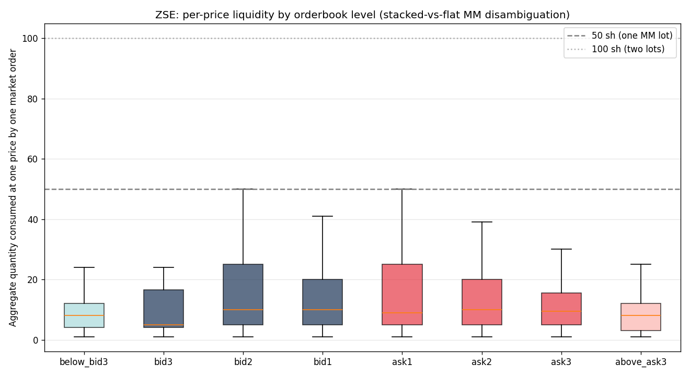


## 3. Per-instrument MM-cleanliness and spread regimes

### MM-clean fraction

`1_mm_clean_pct.png` — fraction of snapshots where every visible
top-3 quantity is a multiple of 50 (i.e., no team residuals leaking in):

- **Cleanest** (>70% both sides): **ZITO, ZABA, SIMP, KRAS, MDKA, DDJH**.
  Their mid IS the MM fair value with very low noise — best candidates
  to anchor cross-venue arbs.
- **Noisiest** (<40%): ETFA3, NGUP, HT, ETFB. Either heavy team or
  noise-trader activity sits on top of the MM ladder; expect to do real
  reconstruction work or wait for clean snapshots.

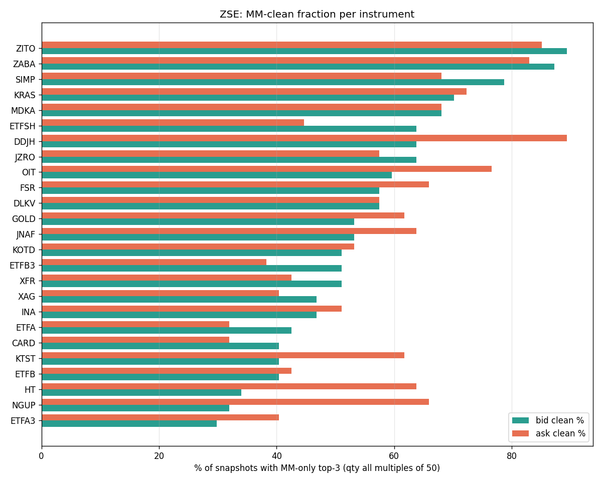

### Spread regimes

`2_spread_box.png` — bimodal across instruments:

- **Tight (2¢ MM spread):** CARD, DDJH, DLKV, ETFB, ETFB3, ETFSH, GOLD,
  OIT, SIMP, ZABA, ZITO. Tick step inside the ladder = 1¢.
- **Wide (4¢ MM spread):** ETFA, ETFA3, FSR, HT, INA, JNAF, JZRO, KOTD,
  KRAS, KTST, MDKA, NGUP, XAG, XFR. Tick step = 2¢.
- **Outliers:** HT (30¢) and NGUP (8¢) — moments where the MM widens,
  almost certainly after an inventory hit. **The widening event itself
  is a tradeable signal** (it precedes mid mean-reversion).

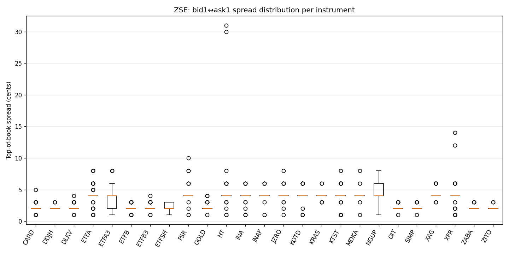


## 4. The MM in motion (cleanest example: ZITO)

`3_book_timeseries.png` — six lines = bid3/2/1/ask1/2/3, ribbon between
bid1 and ask1 = MM spread (2¢), black dots = trade prints.

- The book moves in discrete steps. Between steps the entire 6-level
  ladder is locked at fixed offsets — that's the MM holding fair value
  fixed.
- Trade prints almost always land at the inner edge (bid1/ask1).
  Off-edge prints correspond to noise sweeps consuming multiple levels.
- This view confirms ZITO's mid is essentially the MM's fair value:
  with 89% / 85% MM-clean snapshots, mid = MM fair value most of the
  time.

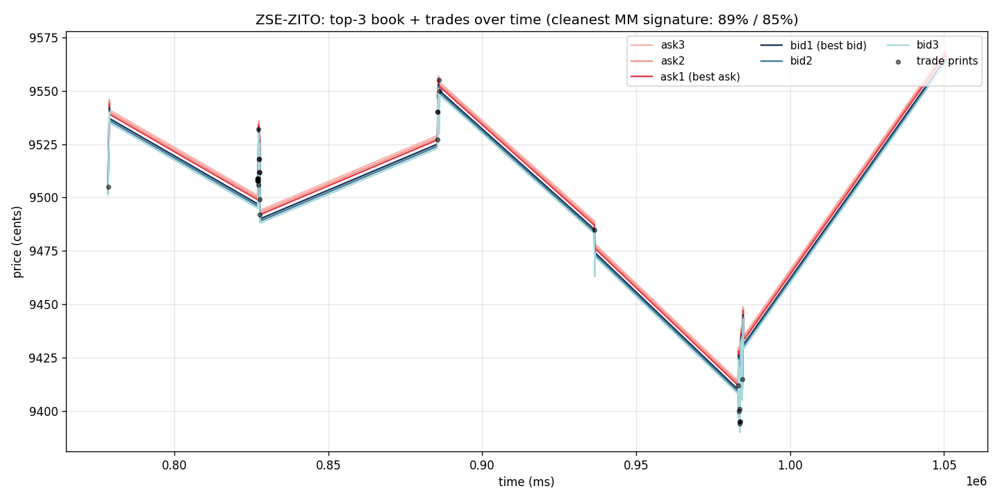


## 5. Evidence for L4 / L5 — trade prints outside the visible top-3

`4_trades_outside_hist.png` — distribution of trade prices outside the
captured top-3, in cents away from `ask3` / `bid3`:

- **53.9%** of all ZSE trades print outside the visible top-3 — large
  enough that the hidden levels are economically important.
- Mass concentrated within ~10¢ of the ask3 / bid3 boundary, which is
  one or two MM tick steps further out → consistent with L4 and L5.
- Long tail (200–1000¢) → noise market orders sweeping deep into the
  book, all the way past L5 into team-only territory.

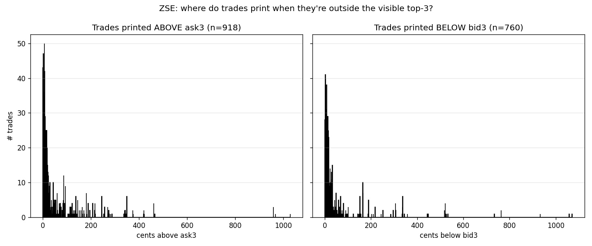


## 6. Inferred MM ladder visualisation (ZABA, one snapshot)

`5_stacked_signature.png` — observed top-3 (solid) plus extrapolated
L4 / L5 (dashed) under the stacked hypothesis. The dotted grey line is
the mid (≈ MM fair value).

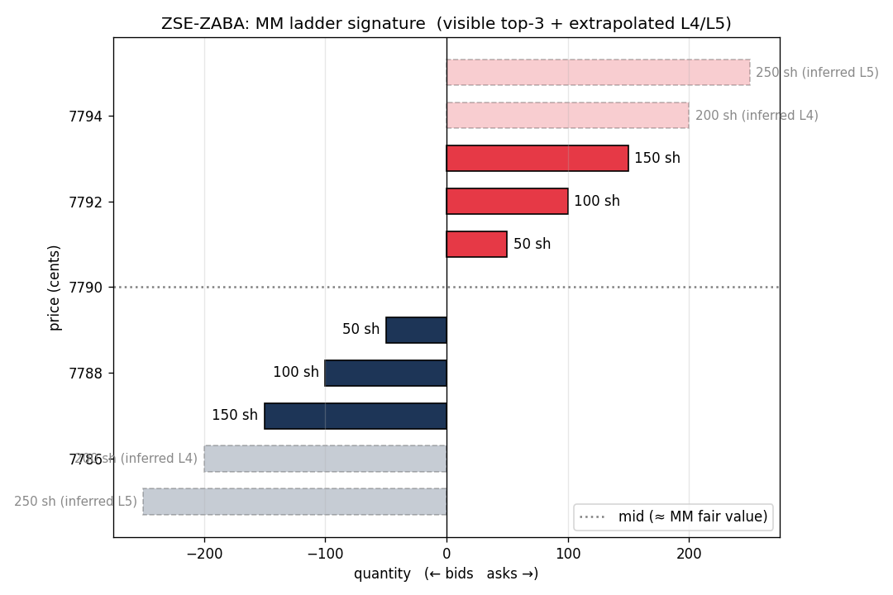


## 7. Predictivity of book imbalance

`7_skew_predictivity.png` — Pearson correlation between the current
top-3 depth imbalance `(bid_depth - ask_depth) / (bid_depth +
ask_depth)` and the change in mid 5 snapshots ahead (≈500 ms).

(The bid/ask "skew" metric `(ask1-mid) - (mid-bid1)` is identically
zero on this dataset — the spread is always even-cents, so mid sits
exactly halfway. It carries no signal here. Depth imbalance is the
substitute that does work.)

| Sign | Interpretation | Examples |
|---|---|---|
| **+0.30 to +0.49** | Bid-heavy book ⇒ mid moves UP (momentum / book-imbalance follow-through) | INA (+0.49), GOLD (+0.35), KTST (+0.35) |
| **+0.10 to +0.20** | Weak momentum | FSR, JNAF, NGUP, DLKV |
| **near zero** | No signal | CARD, JZRO, ETFB |
| **−0.10 to −0.20** | Mild mean-reversion | SIMP, XAG, ZITO, HT, OIT, ETFA3 |
| **−0.20 to −0.40** | Strong mean-reversion | ETFB3 (−0.27), ETFSH (−0.38) |

→ **The same signal needs opposite signs per instrument.** ETFs are
predominantly mean-reverting because their depth imbalance is *driven
by* the MM being mispriced vs constituents — i.e., the imbalance is the
arb pressure unwinding.

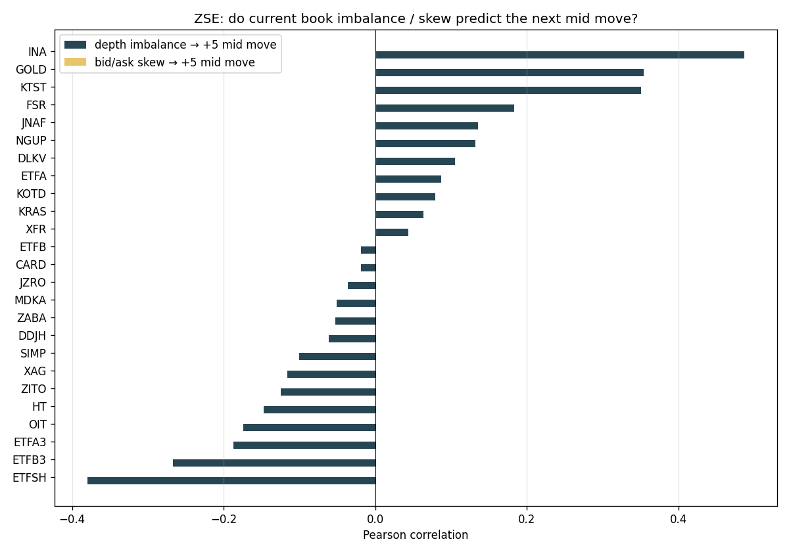


## 8. ETF ↔ basket fair-value gap (the biggest edge)

`8_etf_arb.png` — for each ETF on ZSE, plot MM mid vs the simple equal-
weight mean of constituent ZSE mids (the docs define ETF fair value
exactly that way).

| ETF   | basket present | mean Δ | std Δ | max \|Δ\|  | % time \|Δ\| > 10¢ |
|-------|----------------|--------|-------|------------|--------------------|
| ETFA  | 6 / 6          | +9¢    | 63¢   | **125¢**   | 89% |
| ETFB  | 6 / 6          | +4¢    | 49¢   | 120¢       | 66% |
| ETFA3 | 3 / 3          | −19¢   | 91¢   | **202¢**   | 85% |
| ETFB3 | 3 / 3          | +3¢    | 57¢   | 126¢       | 79% |
| ETFSH | 2 / 2          | −38¢   | 95¢   | **335¢**   | 87% |

For context the MM spread is 2–4¢. Gaps of 100¢+ are 25–50× the
spread — the gap, not the spread, is the dominant alpha source.

**Caveats:**
- This is one recording. The size of the gap may be inflated by sparse
  sampling, light competition, or the MM using non-ZSE inputs to its
  fair-value model.
- A real ETF arb requires hedging the basket — small ETFs (ETFA3,
  ETFB3, ETFSH) are easiest because the basket is 2–3 names.
- ZSE is the only venue that lists every constituent of every ETF, so
  this strategy is **uniquely deployable on ZSE**. Other venues need
  cross-exchange constituent prices, which adds latency uncertainty
  (the 95–180 ms inter-venue RTT is bigger than typical price moves).

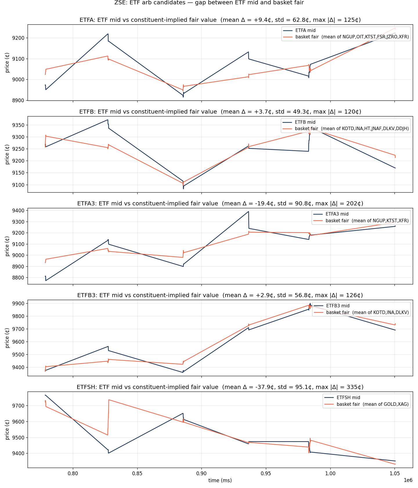


## 9. Strategy candidates from these findings

In rough order of expected edge × ease of implementation:

1. **ETF ↔ basket stat-arb on ZSE.** Build a fair-value series per ETF
   from constituent ZSE mids (top-3 depth-weighted, not just mid, to
   reduce noise). Trade the gap when its rolling z-score crosses ±N.
   Hedge the ETF position with the basket on the same exchange — no
   cross-venue latency.
2. **Depth-imbalance directional bets.** Pick the high-\|correlation\|
   names per the table in §7. Long when imbalance > 0 on momentum
   names, short when imbalance > 0 on mean-reverters. 500 ms horizon.
3. **MM-fair anchoring + cross-venue arb.** On clean ZSE names (ZITO,
   ZABA, SIMP, KRAS, DDJH), use the mid as a low-noise fair anchor.
   When the same name on NYSE/NASDAQ/etc. quotes outside ZSE_mid ± N¢,
   take the trade. Geographic rotation makes this a recurring window.
4. **MM widening as a regime-shift signal.** When MM spread on a name
   blows out (e.g., HT 30¢, NGUP 8¢), it's a near-certain inventory
   hit — fade the move using the wide spread itself as the position-
   sizing limit.


## 10. Cross-exchange MM characterization

Re-ran the full pipeline on every venue. **27 002 orderbook rows ×
71 305 trades × 10 exchanges × 25 unique instruments = 126
(exchange, instrument) signatures**, all in `out/all_mm_summary.csv`.

### MM-clean fraction by venue

`9_clean_pct_by_venue.png` — white cells = instrument not listed there.

- **ZSE is the cleanest venue overall** — most cells in the right column
  are 50–87%. ZITO/ZABA on ZSE both >85%.
- **NASDAQ and NYSE are the noisiest** for several names (CARD ~28–29%,
  ETFB on NASDAQ 28%, ETFA on NYSE 30%) — heavy team activity bleeding
  into the visible top-3.
- **The MM signature is the SAME across venues**: same 50/100/150
  stacked pattern, same per-instrument cleanliness pattern. The MM is a
  per-instrument bot replicated across venues, not a per-venue bot.

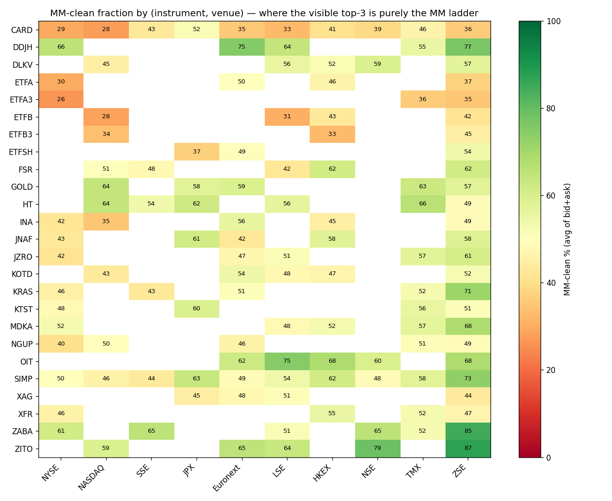

### Spread regimes by venue

`10_spread_by_venue.png` — median MM spread. **The 2¢ vs 4¢ regime is
an instrument property, not a venue property:** SIMP is 2¢ on all 10
exchanges; ETFA is 4¢ everywhere it lists; FSR is 4¢ on every venue.
That means the MM uses one parameter set per instrument across all
venues — the per-instrument spread is **stable and predictable** for
strategy design.

The only mild exceptions are CARD (3¢ on NYSE/NASDAQ/LSE vs 2¢
elsewhere) — a tiny widening at high-volume venues, plausibly because
the MM has wider slippage parameters there.

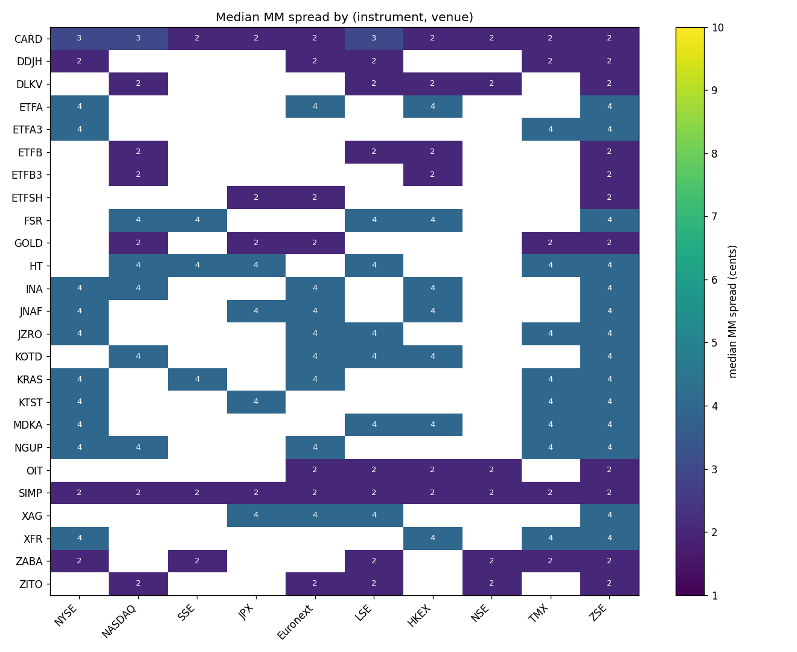


## 11. ETF arb is multi-venue, not a ZSE artefact

`11_etf_arb_by_venue.png` and `out/etf_arb_by_venue.csv`:

| ETF   | Venue    | n   | mean Δ | std Δ | max \|Δ\| | % \|Δ\|>10¢ |
|-------|----------|-----|--------|-------|-----------|--------------|
| ETFA3 | **NYSE** | 406 | −8¢    | 45¢   | **232¢**  | 86% |
| ETFA3 | TMX      | 105 | −5¢    | 34¢   | 78¢       | 74% |
| ETFA3 | ZSE      | 47  | −19¢   | 91¢   | 202¢      | 85% |
| ETFB3 | HKEX     | 104 | +18¢   | 55¢   | 114¢      | 85% |
| ETFB3 | NASDAQ   | 83  | +1¢    | 34¢   | 88¢       | 77% |
| ETFB3 | ZSE      | 47  | +3¢    | 57¢   | 126¢      | 79% |
| ETFSH | Euronext | 178 | +13¢   | 39¢   | 98¢       | 83% |
| ETFSH | **JPX**  | 674 | −4¢    | 45¢   | 158¢      | 80% |
| ETFSH | ZSE      | 47  | −38¢   | 95¢   | 335¢      | 87% |
| ETFA  | ZSE only | 47  | +9¢    | 63¢   | 125¢      | 89% |
| ETFB  | ZSE only | 47  | +4¢    | 49¢   | 120¢      | 66% |

Caveat: for ETFA/ETFB the basket spans 6 stocks and ZSE is the only
venue listing all of them, so cross-venue confirmation isn't possible.
For the smaller baskets (ETFA3, ETFB3 = 3 names; ETFSH = 2 names) the
gap shows up on **every venue we can compute it on**, with NYSE/JPX
having the largest sample sizes (406 / 674 aligned snapshots) and gaps
running into the hundreds of cents.

**Critical implication: the ETF↔basket arb is robust across venues, not
a ZSE quirk.** This dramatically increases the strategy capacity —
trade it on whichever venue you're co-located with for that segment.

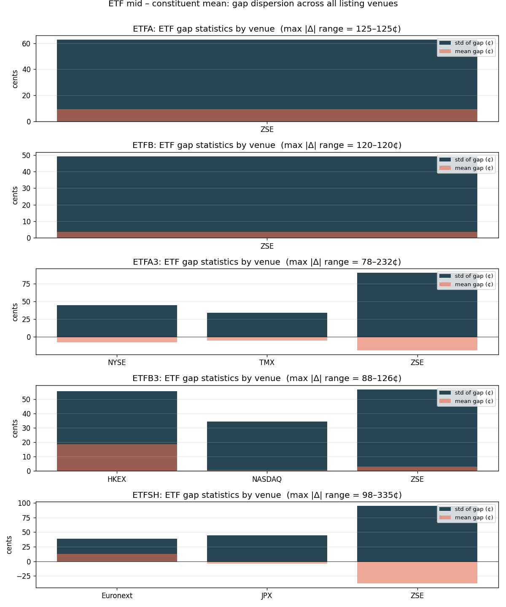


## 12. Cross-venue same-instrument MM mid divergences

`12_cross_venue_divergence.png` and `out/cross_venue_mid_divergence.csv`:
the 20 widest pairs, by max |Δ|, are **all on CARD**, with KRAS just
below.

| Pair | n | mean Δ | std Δ | max \|Δ\| | % \|Δ\|>4¢ |
|---|---|---|---|---|---|
| CARD NSE↔NYSE      | 2793 | −404¢ | 668¢ | **2188¢** | 97.6% |
| CARD NYSE↔ZSE      | 2727 | +591¢ | 735¢ | 2144¢     | 99.2% |
| CARD Euronext↔NYSE | 2806 | −617¢ | 701¢ | 2022¢     | 98.7% |
| CARD JPX↔NYSE      | 2796 | −509¢ | 737¢ | 2017¢     | 96.9% |
| CARD NYSE↔TMX      | 2152 | +726¢ | 831¢ | 1980¢     | 100.0% |
| KRAS NYSE↔SSE      | 2802 | −70¢  | 369¢ | 1224¢     | 98.2% |
| MDKA HKEX↔ZSE      | 2727 | −192¢ | 440¢ | 1198¢     | 100.0% |

The numbers are huge — MM mid on CARD swings by **$5–$22 between
exchanges**, with the gap exceeding the round-trip spread (4¢) more
than 97% of the time. Two interpretations:

1. **Real economic edge.** Each exchange has its own MM with an
   independent fair-value process; flow on one venue doesn't propagate
   to others until cross-venue traders close the gap. Inter-venue
   latencies range 11–180 ms (per the docs), wide enough that mid
   prices drift apart between rebalance pulses.
2. **Recording artefact.** The recordings span multiple round segments;
   if segment boundaries are slightly offset across venues, the
   `time`-aligned join can compare different segments (each independent
   by design, with cash/positions/orders reset). That would inflate the
   apparent divergence.

The truth is almost certainly a mix: real intra-segment drift × big
amplification at segment boundaries. The actionable signal is the
**z-score of the gap within a single segment**, not the raw
divergence. Even at a 90% discount, max |Δ| of 200¢+ per segment gives
ample room above the 4¢ MM spread.

NYSE shows up in 8 of the top 10 CARD pairs because it has the most
data (n≈2800) and the biggest local price moves. NSE, ZSE, TMX,
Euronext are the most divergent counter-parties.

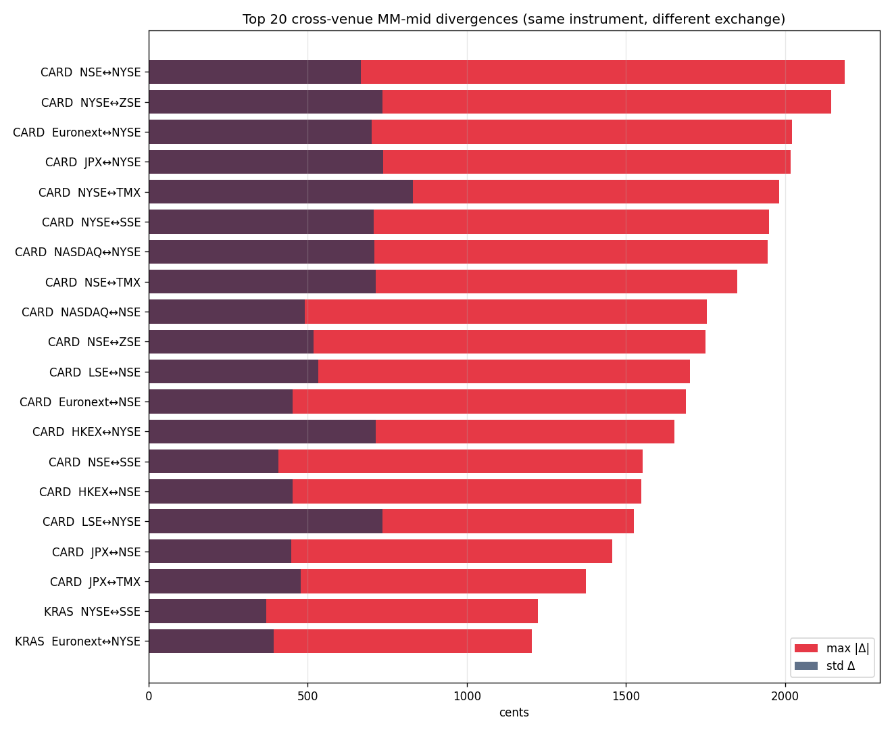


## 13. Updated strategy candidates

| # | Strategy | Edge size | Implementation cost | Notes |
|---|----------|-----------|---------------------|-------|
| 1 | **Cross-venue same-name arb (CARD, KRAS, MDKA)** | very large (100s of ¢) | medium — needs concurrent connections to ≥2 venues + per-segment z-scoring | The biggest persistent signal. CARD listed on all 10 venues, so always tradeable. |
| 2 | **ETF↔basket stat-arb** (ETFA3, ETFB3, ETFSH first) | large (50–100¢) | low — single-venue trade, no cross-venue race | Run on whichever venue you're co-located on per segment. Smaller baskets are easier to hedge. |
| 3 | **Depth-imbalance directional bets** | small per trade (a few ¢) but high frequency | low | Sign per-instrument from §7 / `imb_corr_h5` in `all_mm_summary.csv`. |
| 4 | **MM-fair anchoring on clean venues** | medium | low | Use ZSE-ZITO/ZABA/SIMP/etc. as low-noise fair anchors; trade other venues against them. |
| 5 | **MM widening event fade** | medium per event | low | When MM spread blows out on a name, position to fade as it returns to its 2¢ or 4¢ regime. |


## 14. Open questions / next steps

- **Validate ETF gaps on other venues.** ✅ Done in §11 — confirmed
  multi-venue (NYSE/JPX/HKEX/Euronext/NASDAQ/TMX/ZSE all show gaps).
- **Segment boundary detection.** Identify per-venue segment boundaries
  in the timestamp series (cash/positions reset every 10 min) and
  compute everything within-segment. This will sharpen the cross-venue
  divergence numbers in §12.
- **Order-flow toxicity.** Use the trade `passive_order_id` /
  `active_order_id` to track which orders get hit — informed flow
  hits MM aggressively, noise hits randomly. Helps tune thresholds.
- **Inventory-skew detection on the MM side.** The docs say the MM
  skews quotes based on accumulated inventory. The naive
  `(ask1-mid)-(mid-bid1)` metric collapses to zero (spread always
  even-cents). Need to compare mid to a slower-moving reference
  (rolling VWAP, candle close) or to the *other-venue* mid as the
  baseline.
- **L4 / L5 verification from live API.** Until we trade live we can't
  prove the stacked-vs-flat call definitively. The first thing to log
  in production is the full top-5 broadcast so we can settle this.
- **Cross-instrument correlation within sectors.** Sector A and B
  members should move together; sector deviations are tradeable.
- **Segment-aware ETF arb backtest.** Wire up the §11 gap signal into
  a paper-trading harness (entry/exit on rolling z) and measure
  realized PnL on the recorded data, segment by segment.
